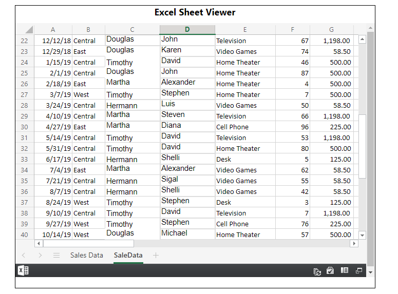
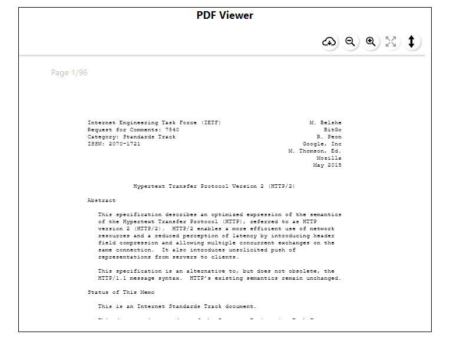
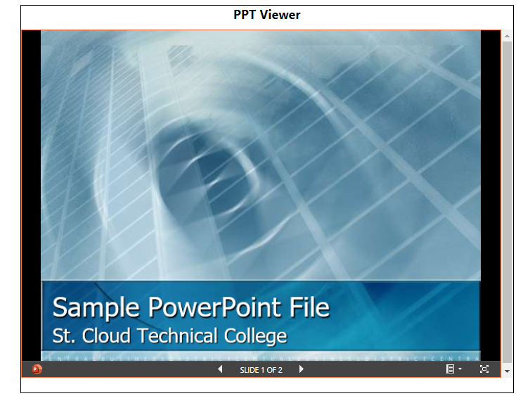
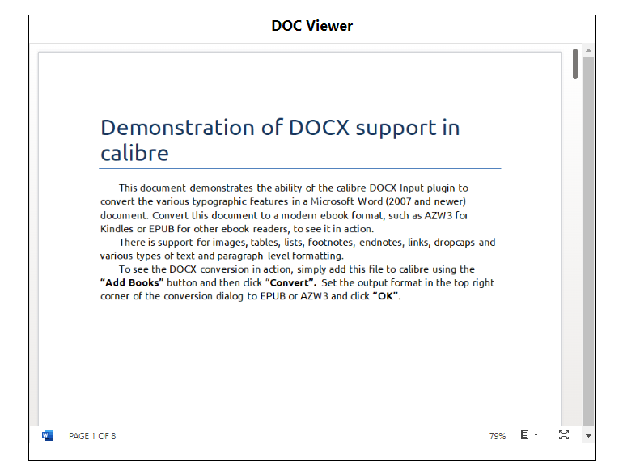

# React Doc Viewer

A document viewer component for React that supports multiple file formats such as PDF, DOC, PPT, Excel, and more. This project is based on `@cyntler/react-doc-viewer`, a fork of `react-doc-viewer`.

## Supported File Formats
- Excel
- PDF
- PPT (PowerPoint)
- DOC (Word)
